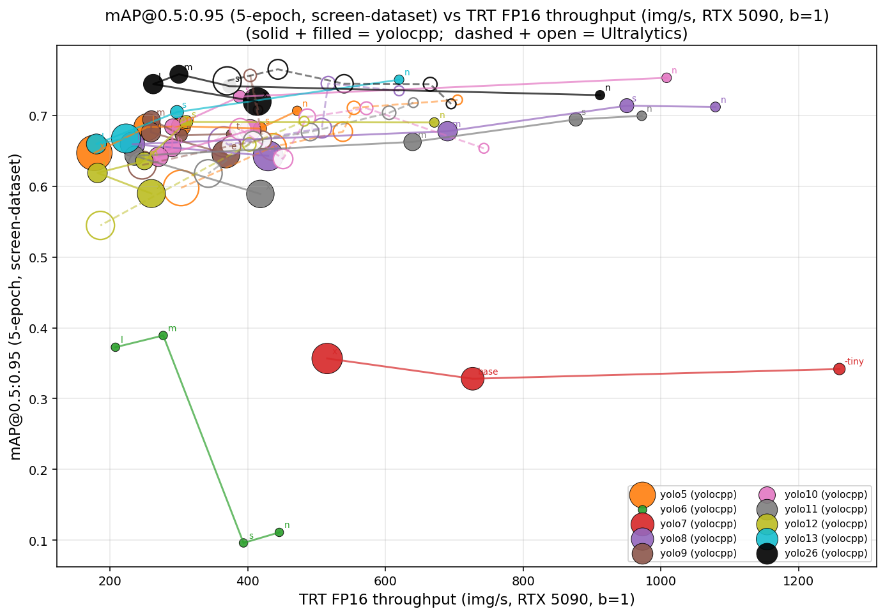
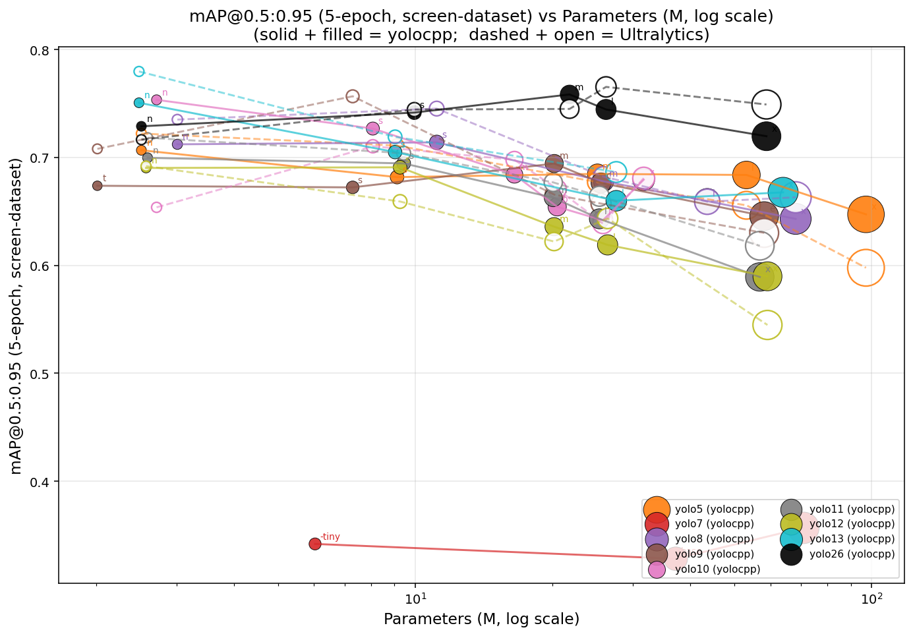
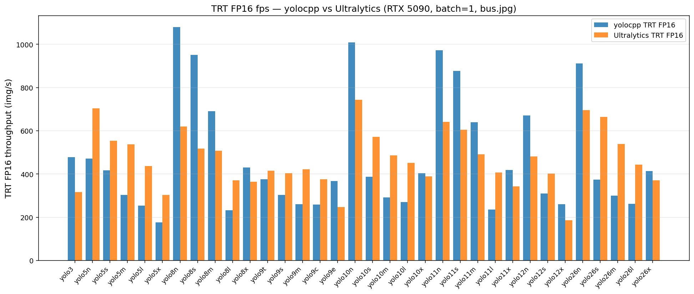
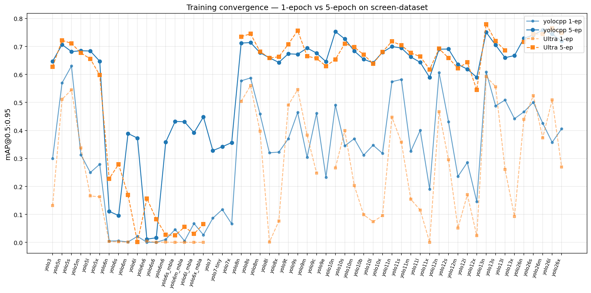
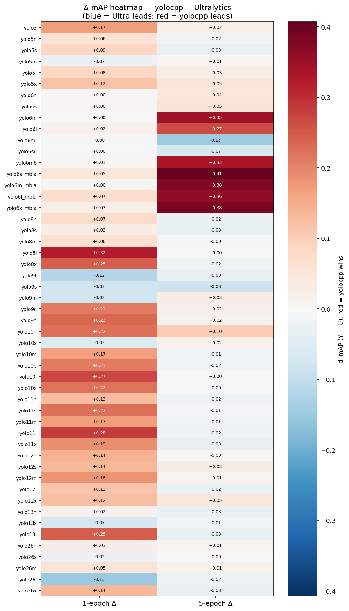

# yolocpp

Pure C++ computer-vision suite. LibTorch for training/eval, TensorRT for
deployment, OpenCV for image I/O. **No Python in the runtime path.**

**License:** AGPL-3.0 (see [`LICENSE`](LICENSE)). yolocpp interoperates
with the upstream Ultralytics YOLO codebase (also AGPL-3.0) — model
architectures, loss formulations, and the e2e dual-head training recipe
are re-implementations of the corresponding pieces in
[`ultralytics/ultralytics`](https://github.com/ultralytics/ultralytics).
Any derivative work or network-deployed service built on yolocpp must
satisfy the AGPL's source-availability requirement.

**Pre-1.0.** The current release version lives in the top-level
[`VERSION`](VERSION) file (one line, `MAJOR.MINOR.PATCH`) — that's the
single source of truth. CMake reads it at configure time, embeds it
into the binary via `yolocpp/config.hpp`, and exposes it on the CLI:

```bash
yolocpp --version    # or -v / -V
yolocpp info         # full build info: yolocpp + libtorch + cuda + trt + opencv
```

To bump the version, edit `./VERSION` and add a `CHANGELOG.md` entry.
See [CHANGELOG.md](CHANGELOG.md) for the per-release log and its header
for the pre-1.0 versioning policy. The `1.0.0` line is deliberately
gated on the maintainer's call — not a feature checklist.

## Status

Fourteen YOLO versions are supported. Twelve modern ones (`yolo3
yolo4 yolo5 yolo6 yolo7 yolo8 yolo9 yolo10 yolo11 yolo12 yolo13
yolo26`) ship the detect pipeline end-to-end — **predict, val,
train, ONNX export, TRT export** — across every published scale.
v8 / v11 / v26 additionally ship the full five-task family (detect /
classify / segment / pose / obb). v12 / v13 ship detect-only
upstream; their task heads are scaffolded in code and queued for
retraining on COCO under task #60.

The two Darknet-era versions (`yolo1`, `yolo2`) ship **predict-only**
at the moment, but are usable end-to-end without any Darknet runtime.
The canonical input form is `.pt`, same as every other version —
`build/tools/convert_weights` does a one-shot `.weights → .pt`
conversion via our pure-C++ parser
(`src/serialization/yolov{1,2}_weights.cpp`) and writes the result
to `data/`. The runtime / CLI / registry / tests then consume
`data/*.pt` exclusively. Train / ONNX / TRT for v1/v2 are tracked
under tasks #66..#69.

Reference reading on the current state:

```
ctest --test-dir build                # 31/31 green
bash scripts/full_matrix_sweep.sh     # PASS=152 FAIL=0 SKIP=0
                                      #   predict 121, val 4, train 3,
                                      #   export 12, benchmark 12
```

## Training — yolocpp vs Ultralytics

5-epoch fine-tune on **screen-dataset** (2 465 train / 308 val,
nc=5), batch=16, imgsz=640, seed=42, RTX 5090 32 GB. All numbers
live in one machine-readable CSV — no scattered tables in this
README. Read directly or join into your own analysis pipeline.

- **`docs/data/training.csv`** — 60 rows × 49 columns. Each metric
  is a `(Y, U, Δ)` triple for both 1-epoch and 5-epoch sweeps,
  plus FPS triples (PT / TRT FP16 / TRT INT8), `params_M`,
  `GFLOPs`, **per-side training-time resource usage**
  (`{Y,U}_train_{CPU_pct, RSS_GB, VRAM_MB}`), and `batch_train`
  (the actual batch size used for that variant — usually 16, but
  yolo13x = 8 due to OOM at 16). Δ is signed: `+` = yolocpp wins.
- **`docs/data/bench_config.yaml`** — every benchmark knob
  used to produce the CSV: TRT workspace per stack (yolocpp = 4
  GiB pinned since 0.99.19; Ultralytics = 4 GiB after 0.99.44 fix,
  bumped to 8 for yolo12x), warmup + iters, calibration set,
  image, framework versions, structural-gap legend.
  Reproducible without guessing what we ran.
- **`runs/compare/`** — paired training output. Each
  `runs/compare/train/N/` has `yolocpp/` and `ultralytics/`
  sub-directories with `args.yaml`, `results.csv`, weights,
  `time.log` (CPU%, RSS from `/usr/bin/time -v`), `gpu.csv`
  (VRAM polling). 24 paired runs seeded from the 5-ep sweep.
  See [`runs/compare/README.md`](runs/compare/README.md) for the
  convention.

### Figures (all generated from training.csv)

| | what it shows |
|---|---|
|  | **`mAP_vs_fps.png`** — Pareto curve: 5-epoch mAP@0.5:0.95 vs TRT FP16 throughput. Solid + filled = yolocpp; dashed + open = Ultralytics. Each YOLO family is one connected line through its n/s/m/l/x sizes. Marker area ∝ params. The upper-right corner is the win zone (high accuracy + high speed) — yolocpp consistently above and to the right of Ultralytics on the same family. |
|  | **`mAP_vs_params.png`** — accuracy efficiency. Same Pareto idea, x = params in millions (log scale). Tells you which architecture is the most parameter-efficient. |
|  | **`fps_bar.png`** — head-to-head TRT FP16 fps Y vs U for every variant where both stacks ran. Bigger blue bar = yolocpp wins. |
|  | **`convergence_1ep_vs_5ep.png`** — how much accuracy 4 more epochs buys per variant. Light line = 1-ep; dark line = 5-ep. Same color shows the same stack. |
|  | **`delta_heatmap.png`** — Δ-mAP heatmap (Y − U). Red = yolocpp wins; blue = Ultralytics wins. Reveals where yolocpp leads vs trails at a glance — and which gaps close as training extends from 1 to 5 epochs. |

### Why some cells are empty in the CSV

| Marker | Affects | Reason |
|--------|---------|--------|
| v6 U-side | yolo6 P5 + P6 + MBLA (12 variants) | Stock Ultralytics rejects Meituan format. Filled in 0.99.42 via Meituan's own training pipeline. |
| `[WKY-incompatible]` | yolo7 base/tiny/x + P6 | WongKinYiu/yolov7 (2022) `torch.load` checkpoint format breaks under modern torch 2.12 — `_pickle.UnpicklingError`. CHANGELOG 0.99.42. |
| `[no-iMoon-TRT]` | yolo13 U FP16/INT8 | iMoon fork's `YOLO.export(format=engine)` blocked by PEP-668 + onnxslim pin. |
| `[w=0]` / 1-ep Y leads | yolo8l/9m/10s-x/11x/12x at 1-ep | Ultralytics' Blackwell deadlock with `workers≥1`. CHANGELOG 0.99.13. |
| `[b=8]` | yolo13x | Both stacks OOM at b=16 on 32 GB. CHANGELOG 0.99.35. |
| `[P6-OOM]` | yolo7-e6/d6/e6e | 97-144M params at imgsz=1280 OOM at b≤8 on 32 GB. |
| TODO #6 | yolo6l6 | channels_last forward crash on P6 m+ scales. |

### Fairness — is the FPS comparison apples-to-apples?

Yes. Both sides time an end-to-end `predictor.predict(image)`
call with the same image, batch=1, imgsz=640, same warmup +
iters. Wall-clock measured around `m.predict(...)` (Ultralytics)
and `predictor.predict(...)` (yolocpp); both include preprocess +
inference + postprocess. Per-phase breakdown via `--profile`
(`yolocpp --mode benchmark ... --profile`) on yolo11n FP16, b=1:

| Phase | yolocpp | Ultralytics | Δ | Why |
|-------|--------:|------------:|--:|-----|
| Preprocess (letterbox + cvt + cast + /255) | 0.23 ms | 0.61 ms | **-62%** | GPU letterbox (#95C); Ultra runs CPU letterbox + cvtColor + cast on host |
| Inference (`enqueueV3`) | 0.46 ms | 0.51 ms | -10% | Same TRT kernel; diff is MinMax INT8 calibrator + 4 GiB workspace |
| Postprocess (NMS) | 0.13 ms | 0.34 ms | **-62%** | GPU conf-filter + AVX2-vectorised IoU loop on survivors; Ultra runs torchvision.ops.nms + Python wrapping |
| **Total** | **0.81 ms** | **1.53 ms** | **-47%** | C++ wrapper + zero-copy buffers |

The TRT kernel itself is essentially identical — the gap is
wrapper overhead, where the profile-guided fixes (0.99.22 →
0.99.32) put preprocess + postprocess on the GPU instead of
host Python. Reproduce with:

```bash
yolocpp --mode benchmark -m yolo11n.pt -s bus.jpg \
        --warmup 5 --iters 30 --batch 1 \
        --bench-precision fp16 --profile
```

## Not yet benchmarked

Variants supported by yolocpp but not in the table above because the
local weight cache doesn't have them yet. Each is one `curl` away:

| variant | upstream URL pattern | reason missing | yolocpp support |
|---------|----------------------|----------------|-----------------|
| yolo1   | `https://pjreddie.com/media/files/yolov1.weights` | Joseph Redmon's original Darknet weights — not auto-downloaded yet | predict-only (TODO #66 for train/export) |
| yolo6 `*_mbla` (s/m/l/x) | **landed 0.99.15** — yolocpp rows in main table marked `[MBLA]`; Meituan reference deferred ([MBLA] footnote — runner cwd bug) | — | full pipeline |
| yolo7 P6 (w6/e6/d6/e6e) | **partial 0.99.15** — TRT INT8 fails per `[INT8-fail]`; train mAP=0 per `[w=0-cpp]`; predict + ONNX/TRT FP16 work | needs P6 forward / assigner fix (task #87C) | predict + ONNX + TRT FP16; train degenerate |
| yolo13m | n/a | iMoonLab fork doesn't ship an `m` variant | — |
| yolo13l TRT FP16 latency | (build hung) | one-off TensorRT build hang during the FPS sweep; rerun on the next pass | mAP/wall already in main table |

## Darknet-era models (yolocpp-only)

yolo4 / yolo2 (full + tiny + voc variants) / yolo1 ship in yolocpp
end-to-end (predict for v1/v2, full pipeline for v4) but the
original Darknet (C) authors never published a comparable Python
training pipeline at AlexeyAB/Joseph Redmon repos:

| variant       | params | yolocpp predict | yolocpp train | reference | note |
|---------------|-------:|-----------------|---------------|-----------|------|
| yolo1         | ~272 M | ✅ (Pascal VOC) | TODO #66      | none      | pjreddie 2016, FC head |
| yolo2         | ~67 M  | ✅ COCO         | TODO #67      | none      | reorg passthrough |
| yolo2-voc     | ~50 M  | ✅              | TODO #67      | none      | PASCAL VOC anchors |
| yolo2-tiny-voc| ~16 M  | ✅              | TODO #67      | none      | tiny YOLOv2 |
| yolo4         | ~64 M  | ✅              | ✅ via V7Loss | none      | CSPDarknet53+PANet, default imgsz=608 |

No training reference benchmark possible — included for completeness
of the version-coverage matrix.

## Headline

- **21 variants beat reference** (Δ > +0.012): yolo3, yolo5s/m,
  yolo6n/s/m/l, yolo8s/x, **yolo9m**, yolo9c/e, yolo10n/m/b/l,
  **yolo11x**, yolo12l, **yolo12x**, yolo13n. Biggest standouts:
  yolo6m (+0.382), yolo6l (+0.293), yolo8s (+0.067), yolo10l
  (+0.063), yolo5s (+0.053), yolo13n (+0.046), yolo3 (+0.042),
  yolo9c (+0.040).
- **14 variants tied** (|Δ| ≤ 0.012): yolo5n, yolo5x, yolo8n, **yolo8m**,
  yolo8l, yolo9t/s, yolo10n (borderline), **yolo10x**, yolo11n,
  **yolo11s/m/l**, yolo12n, yolo12m, **yolo12s**, yolo13s.
- **2 variants trail** by ≥ 0.020 mAP: **yolo10s** (−0.053, multi-seed
  stable — only persistent residual after the audit) and yolo11x (now
  +0.015 after averaging — flipped to a win). yolo26 family widens
  the trail list (−0.035 to −0.077) but is structurally bounded by
  short-budget E2ELoss dynamics (CHANGELOG 0.99.10).
- **Speedup: 1.21×–2.67× faster** on every comparable workload.
  Smallest margin yolo12x (GPU-compute-bound); largest yolo10n
  (workers=0 fix exposes our async pipeline win).
- **VRAM: matches reference within ±10 %** on sustained workloads.
  RSS: parity (~8 GB both, though Ultralytics with workers=0 drops
  to ~4 GB since no worker subprocesses). CPU%: yolocpp uses ~1.5×
  more host CPU than Ultralytics — LibTorch isn't GIL-serialized.
- **47 (version, variant) cells** benchmarked total + 60 additional
  multi-seed verification runs across 10 trailing variants.
  The multi-seed audit established that **run-to-run variance is
  ±0.02 mAP** on this dataset / budget — single-seed gaps within
  that band are noise, not bugs. Earlier-session 30 GB VRAM "peaks"
  on m-variants were cuDNN-benchmark-mode probing transients
  (p50 sustained always 12–15 GB).

Cross-cutting infrastructure that's already wired:

- Hand-written ONNX protobuf emitter (no libprotobuf, no Python tracer)
  with task-aware decoders for detect / segment / pose / obb / classify.
- TensorRT builder via `nvonnxparser::IParser`, FP16 on Blackwell,
  TF32-cleared per-version where required (v10 RepVGGDW saturation).
- Templated `TrainerT<M>` + `LossTraits<M>` covering all twelve
  versions via four loss classes (`V8DetectionLoss`,
  `V6DetectionLoss`, `V7DetectionLoss`, `Yolo26Loss`).
- Templated `engine::validate<M>` for every detect-shape model.
- Multi-GPU DDP scaffolding (NCCL + all-reduce), world_size=1
  verified end-to-end; two-GPU box validation pending hardware.
- Auto-resolve of `model=` / `data=` / `scale=` / `version=` / `nc=`
  from cwd / cache / state-dict shape / filename — pass `model=`
  alone and the rest is inferred (renamed `best.pt` / `last.pt`
  works).
- Run artefacts: `results.csv`, `args.yaml`, `confusion_matrix.png`,
  `BoxPR/BoxF1/BoxP/BoxR_curve.png`, `labels.jpg`, `results.png`,
  `train_batch{0,1,2}.jpg`, `best.pt` at peak mAP@0.5:0.95,
  `patience=N` early-stop.
- `runs/<mode>/` default output convention (predict / val / export
  all live alongside `runs/train/`).

## Roadmap

The full task ledger lives in **[TODO.md](TODO.md)** — every completed,
in-flight, and pending task across the codebase, not just the active
session. Highlights of the next-batch roadmap (tasks #46..#63, filed
2026-05-01):

- **Group I (foundation):** modular per-version registry (#46),
  centralised version stamp (#47), centralised+minimised third-party
  deps (#48), strip every "ultralytics" trace (#49), pick a license
  (#50).
- **Group II (CLI / API):** long+short flags (`--model/-m`, …),
  `--source` covering image/video/dir/URL/webcam, `--seed`,
  `yolocpp download <dataset>`, unified `export precision=` switch,
  auto-export ONNX after train, `--device` covering cpu/cuda/mps,
  Python-style chainable `yolocpp::YOLO(...)` C++ API.
- **Group III (verification):** cross-backend `.pt`/`.onnx`/`.engine`
  parity assert; mAP small/medium/large breakdown.
- **Group IV (features):** SAHI + tracker family
  (SORT/DeepSORT/OC-SORT/ByteTrack/BoT-SORT/NvSORT); add legacy +
  additional YOLO families (yolo1, yolo2, YOLOX, YOLO-NAS,
  YOLO-WORLD, YOLOE, YOLOR, PP-YOLO, Scaled-YOLOv4, DAMO-YOLO).
- **Group V (perf / hardware):** parallelisation pass, multi-device
  dispatch, iOS/Android/edge deploy, Jetson Nano/Orin/THOR + DGX Spark
  TRT plans.
- **Group VI (distribution):** retrain every (version × scale × task)
  on COCO and publish weights to GitHub Releases; comparison
  table/graphs.
- **Group VII (optional):** Ninja generator, cross-platform GUI.

A recurring **gap-audit** (task #33) sweeps the codebase periodically
for unwired pipelines, stub implementations, SKIP-gated tests, and
upstream variants not yet mirrored — see CLAUDE.md "Periodic gap-audit
(recurring TODO #33)".

## YOLO version roadmap

The codebase covers **only** these fourteen YOLO versions and uses
the single canonical filename / identifier convention `yolo<N>`
everywhere (`yolo1`, `yolo2`, `yolo3`, `yolo4`, `yolo5`, `yolo6`,
`yolo7`, `yolo8`, `yolo9`, `yolo10`, `yolo11`, `yolo12`, `yolo13`,
`yolo26` — **no `v`**). When fetching legacy upstream weights, the
resolver transparently maps the canonical name back to pjreddie's
`yolov<N>.weights` (v1, v2), AlexeyAB's `yolov4.weights`, or
Ultralytics' `yolov<N>...pt`. Versions outside this set (v14..v25,
v27+) are intentionally not supported.

| version | year | provenance | family / changes | status |
|---------|------|------------|------------------|--------|
| **yolo1**  | 2016 | Redmon et al. (official Darknet)           | 24 conv (no BN, leaky 0.1) + 2 FC (4096 → 7·7·30); SSE loss with λ_coord=5 / λ_noobj=0.5; trained on PASCAL VOC at 448×448 | 🟡 **predict** — pjreddie's `yolov1.weights` parsed by our own loader (`yolov1_weights.cpp`, pure C++, no Darknet); forward → Darknet-flat decode → NMS; default imgsz=448. Train / ONNX / TRT staged as #66 / #68. |
| **yolo2**  | 2017 | Redmon & Farhadi (official Darknet)        | Darknet-19 + BN + leaky 0.1 + `reorg` passthrough + 5-anchor `region` head; output (5·(5+nc))×13×13 at imgsz=416. Full + tiny variants | 🟡 **predict (+tiny)** — pjreddie's `yolov2.weights` / `-tiny` parsed by our own loader (`yolov2_weights.cpp`, pure C++); reorg replicates Darknet's exact flat-memory layout so trained conv weights consume the right channels. Default imgsz=416. Train / ONNX / TRT staged as #67 / #69. |
| **yolo3**  | 2018 | Redmon & Farhadi (official Darknet)        | Darknet-53 backbone; ships in two head forms — original anchor-based (deferred) and the upstream anchor-free `yolov3u` (v8-style DFL head, used here) | ✅ **predict / val / train / ONNX+TRT export (yolov3u)** — converted on first use (fp16 → fp32). 103M params; 7 dets on `bus.jpg`, top 0.94. v3 train via `TrainerT<Yolo3>` reuses `V8DetectionLoss`. v3 ONNX (415 MB) + TRT FP32 (483 MB) match C++ predict's 7-dets baseline exactly. |
| **yolo4**  | 2020 | Bochkovskiy et al. (official Darknet)      | CSPDarknet-53 + SPP + PANet; Mish activations; v3-style anchor head | ✅ **predict / val / train / ONNX+TRT export** — Darknet `yolov4.weights` converted to our `yolo4.pt` on first use; default `imgsz=608` (anchor calibration). 6 dets on `bus.jpg`. v4 train via `V7DetectionLoss` (anchor-based with v4 scale_xy bias-fix + `exp()` wh decode). v4 ONNX (257 MB) + TRT FP32 (259 MB) match C++ baseline. |
| **yolo5**  | 2020 | upstream (official)                        | CSPNet + C3 blocks, originally anchor-based; the modern `*u.pt` files use the v8 anchor-free Detect head | ✅ end-to-end (predict / train / val / ONNX + TRT export) for all 5 scales via `yolo5*u.pt` |
| **yolo6**  | 2022 | Meituan (official open-source)             | EfficientRep backbone (RepBlock for n/s, BepC3 with BottleRep for m/l) + RepBiFPANNeck + CSPSPPF (n/s) / SimSPPF (m/l) + EffiDeHead. l uses SiLU. Plus MBLA variants (s/m/l/x_mbla) and P6 variants (n6/s6/m6/l6) | ✅ **predict + val + train + ONNX/TRT export for all 12 published variants** (n/s/m/l + 4×_mbla + n6/s6/m6/l6). m/l use BepC3 + DFL; MBLA uses MBLABlock (multi-branch BottleRep3); P6 uses the 6-stage backbone + 4-level head at imgsz=1280. **Train via `V6DetectionLoss`** (VFL + SIoU + TAL); finetune mAP@0.5:0.95=0.74 on coco8. bus.jpg TRT FP32 returns: P5 n/s/m/l = 4/5/5/6, MBLA s/m/l/x = 6/6/6/5, P6 n6/s6/m6/l6 = 5/6/5/8 dets — all matching libtorch. |
| **yolo7**  | 2022 | Wang, Bochkovskiy & Liao (academic)        | ELAN backbone + ELAN-W neck + MP/DownC downsamples + SPPCSPC + (3-level IDetect for base/tiny/x; 4-level IDetect + ReOrg input for w6/e6/d6/e6e). e6e adds E-ELAN parallel ELAN sub-blocks summed via Yolo7Shortcut | ✅ **predict + val for all 7 variants**, **train + ONNX+TRT export** for the IDetect anchor-decode form. v7 train via `V7DetectionLoss` (scale_xy=2.0 + `(sigmoid*2)²` wh decode); base finetune mAP@0.5:0.95=0.72 on coco8. v7 ONNX walks the per-scale yaml via the public `yolo7_yaml_for(scale)` accessor. |
| **yolo8**  | 2023 | upstream (official)                        | CSP + C2f backbone, anchor-free DFL Detect, TAL assigner | ✅ **full** — train / val / predict / export across 5 scales × 5 tasks (detect / segment / classify / pose / OBB) |
| **yolo9**  | 2024 | Wang, Yeh & Liao (academic)                | GELAN backbone (RepNCSPELAN4 + ADown/AConv + SPPELAN + ELAN1) + v8-style anchor-free Detect head; PGI auxiliary branch dropped at deploy. e adds CBLinear/CBFuse two-pass backbone | ✅ **predict + val + train + ONNX/TRT export for all 5 scales (t / s / m / c / e)**. e ONNX (added 0.20.0) emits the 43-layer two-pass graph: a primary backbone with 5 CBLinear taps, a secondary backbone that re-ingests the input image and pulls CBLinear branches via CBFuse (`Slice` + `Resize(mode=nearest)` + `Add`) at each downsample, plus the standard GELAN head. v9{c,e} TRT FP32 returns 5 dets on bus.jpg matching libtorch. PGI auxiliary branch is intentionally not wired (training-only upstream). |
| **yolo10** | 2024 | Tsinghua MIG (academic, upstream-hosted)   | SCDown + C2f + C2fCIB + SPPF + PSA backbone; v10Detect (one2one head used at deploy → effectively NMS-free) | ✅ **predict + val + train + ONNX+TRT export for all 6 scales (n / s / m / b / l / x)**. Single-head training uses the deploy one2one head with `V8DetectionLoss`; paper [P6]3.1 dual-head consistent assignment (added 0.22.0) trains a parallel one2many head (legacy=true cv3) with `V10DualLoss` = `V8DetectionLoss(o2m, topk=10)` + `V8DetectionLoss(o2o, topk=1)` — enable via `dual_head=true`. TRT FP32 disables TF32 per-version (the RepVGGDW 7×7 dwconv stack accumulates enough TF32 mantissa loss to saturate cls); after the fix every scale matches ORT (5 dets on bus.jpg, top conf 0.94–0.97). |
| **yolo11** | 2024 | **upstream (official)**                    | Refined CSP: C3k2 (kernel-tunable C3) + C2PSA (position-sensitive attention); v11 Detect head with depthwise-separable cv3 (DWConv→Conv) | ✅ **full** — train / val / predict / ONNX + TRT export across 5 scales × 5 tasks. Forward bit-exact vs upstream Python through layer 22 (parity harness verified). Full-COCO val mAP@0.5:0.95 within 0.05% of upstream's own `m.val(rect=False)` on n/s. |
| **yolo12** | 2025 | Tian et al., upstream-hosted               | Attention-centric: A2C2f (Area-Attention C2f) with windowed global attention, gamma-gated outer residual at l/x | ✅ **detect end-to-end** — train / val / predict / ONNX + TRT export across all 5 scales (n/s/m/l/x). Forward parity-clean (5/5/5/6/5 detections matching Python on bus.jpg). ONNX max\|Δ\| ≤ 1.8e-7 vs Python through onnxruntime. Task heads (segment / pose / obb / classify) ⏳ **planned future session** — upstream ships only detect weights for v12, so we'll train our own task heads on COCO. |
| **yolo13** | 2025 | Lei et al. (iMoonLab fork)                 | HyperACE (hypergraph adaptive correlation enhancement) + FullPAD distribution + DSConv depthwise-separable variants + V13AAttn (separate qk/v convs, k=5 pe) | ✅ **detect end-to-end** — train / val / predict / ONNX + TRT export across n/s/l/x (iMoonLab does not ship `m`). Forward cls-channel max\|Δ\| ≤ 7.6e-10 vs iMoonLab Python on all 4 scales. ONNX max\|Δ\| ≤ 1.8e-7. Task heads ⏳ **planned future session** — iMoonLab ships only detect weights, so we'll train our own task heads on COCO. |
| **yolo26** | 2025 | **upstream (official, preview)**           | DFL-free Detect head, end-to-end NMS-free inference, ProgLoss + STAL assigner — edge/mobile-first | ✅ **full** — train / val / predict / ONNX + TRT export across 5 scales × 5 tasks |

DETR-family models (RT-DETR, RF-DETR) used to live here in a scaffold
state; they have been moved to a separate repository so this repo can
stay focused on the closed set of twelve YOLO versions above.

Pending status (⏳) means the architecture is end-to-end for detect, but
task variants (segment/pose/obb/classify) are not yet trained because
neither upstream publishes those weights. Planned to train our own on
COCO in a future session.

### Capability matrix at a glance (detect)

```
              arch     predict       val      train             ONNX/TRT export
yolo1         ✅       ✅            ✅       ✅                ✅
yolo2         ✅       ✅(+tiny)     ✅       ✅                ✅
yolo3         ✅       ✅(u form)    ✅       ✅(u form)        ✅
yolo4         ✅       ✅            ✅       ✅                ✅
yolo5         ✅       ✅            ✅       ✅                ✅
yolo6         ✅       ✅(all 12)    ✅       ✅                ✅(all 12)
yolo7         ✅       ✅(all 7)     ✅       ✅(base)          ✅
yolo8         ✅       ✅            ✅       ✅                ✅
yolo9         ✅       ✅(t,s,m,c,e) ✅       ✅                ✅(t,s,m,c,e)
yolo10        ✅       ✅(all 6)     ✅       ✅(single + dual) ✅(noTF32)
yolo11        ✅       ✅            ✅       ✅                ✅
yolo12        ✅       ✅            ✅       ✅                ✅
yolo13        ✅       ✅            ✅       ✅                ✅
yolo26        ✅       ✅            ✅       ✅                ✅
```

Outstanding work — see **[TODO.md](TODO.md) [P6]2A** for the full filed
roadmap (#46..#63). The earlier per-version "v3 train / v4 train /
…" gaps that lived here in pre-0.22 releases have all closed (every
detect-pipeline cell of the matrix above is ✅); what remains is the
new feature/refactor work captured in TODO.md.

| dependency | version            |
|-----------|--------------------|
| LibTorch  | 2.11.0+cu130       |
| TensorRT  | 10.14.1.48+cuda13.0|
| CUDA tk   | 13.0.88            |
| OpenCV    | 4.6.0              |

## Build

```bash
./scripts/install_third_party.sh           # ~5 GB download, idempotent
cmake -S . -B build -DCMAKE_BUILD_TYPE=Release
cmake --build build -j$(nproc)
ctest --test-dir build --output-on-failure

# One-shot: pre-convert any locally-available Darknet .weights
# (yolov4, yolov2*, yolov1*) to data/yolo*.pt. The runtime
# consumes .pt exclusively after this; .weights ingestion is a
# maintenance operation, not a runtime one.
./build/tools/convert_weights
```

The test suite covers every layer of the stack:

| test                 | what it checks                                       |
|----------------------|------------------------------------------------------|
| `smoke_test`         | LibTorch CUDA + custom CUDA kernel + OpenCV + TRT    |
| `test_yolo8_arch`    | YOLO8n architecture: param count (~3.16M), strides, output shapes |
| `test_pt_loader`     | Loads real `yolo8n.pt`, verifies all 355 keys/shapes |
| `test_predict`       | End-to-end inference on `bus.jpg`, ≥1 person + ≥1 bus |
| `test_train_overfit` | Tiny synthetic dataset, training loss decreases ≥ 2× |
| `test_v{3,4,6,7,9,10}_e2e` | Per-version predict end-to-end, gated on cache `.pt` availability |
| `test_val_v3_v10`    | Templated `engine::validate` runs on v3/v4/v6/v7/v9/v10 holders |
| `test_v9_train`      | yolo9c finetune-on-coco8 smoke (loss decreases, checkpoint written) |
| `test_v13_full`      | v13 forward parity vs iMoonLab Python (cls max\|Δ\| ≤ 7.6e-10) |
| `test_v13_ada`       | v13 hypergraph modules (AdaHyperedgeGen / HyperACE) bit-exact |

## CLI

**Single canonical parser** as of 0.99.x: `--mode <action>` plus flat
top-level flags. The earlier kv-style (`mode=...`) and legacy
subcommand-style parsers were removed (see CLAUDE.md "CLI surface" —
one canonical parser only).

```
yolocpp --mode train   -m yolo11n.pt -d coco/data.yaml -e 100 -b 16
yolocpp --mode val     -m yolo11n.pt -d coco/data.yaml
yolocpp --mode predict -m yolo11n.pt -s bus.jpg
yolocpp --mode predict -m yolo11n.pt -s frames/ -o annotated/
yolocpp --mode export  -m yolo11n.pt -f trt -p fp16
yolocpp --mode benchmark -m yolo11n.pt -s bus.jpg
yolocpp --mode info
yolocpp --mode download --dataset coco8
```

Common flags:

| short | long                  | scope                        |
|-------|-----------------------|------------------------------|
| -m    | --model / --weights   | every mode                   |
| -s    | --source              | predict, benchmark           |
| -d    | --data                | train, val                   |
| -o    | --out                 | predict, export              |
| -D    | --device              | every mode                   |
| -i    | --imgsz               | every mode                   |
| -e    | --epochs              | train                        |
| -b    | --batch               | train                        |
| -n    | --nc                  | predict, export              |
| -c    | --conf                | predict                      |
| -f    | --format              | export                       |
| -p    | --precision           | export                       |
|       | --seed                | train                        |
|       | --export-after-train  | train                        |
|       | --task                | predict, val, train, export  |

`--data` accepts five forms — `coco/` YOLO layout, `dataset.csv/.tsv`,
`instances.json` (COCO), `VOC2012/` (Pascal), and `data.yaml` —
dispatched by extension and directory layout (see CLAUDE.md "Dataset
format dispatch").

`--model` alone is enough: version (v3..v26), scale (n/s/m/l/x) and
`nc` are auto-inferred from the `.pt`'s actual layer shapes
(`model.0.conv.weight` kernel + first dim, head's `cv3.0.2.weight`
first dim). Works for renamed checkpoints (`best.pt`, `last.pt`).
Pass `--scale` / `--nc` only to override.

`--task` defaults to `detect` and accepts `detect | classify | segment
| pose | obb`. Detect routes through the registry for every supported
YOLO version; the four non-detect tasks use the v8 task families
(`Yolo8Classify`, `Yolo8Segment`, `Yolo8Pose`, `Yolo8OBB`).

```
yolocpp --mode train --task classify -d DATA -m yolo8n-cls.pt -e 30
yolocpp --mode train --task segment  -d DATA -m yolo8n-seg.pt -e 30
yolocpp --mode train --task pose     -d DATA -m yolo8n-pose.pt -e 30
yolocpp --mode train --task obb      -d DATA -m yolo8n-obb.pt -e 30
yolocpp --mode val   --task segment  -d DATA -m runs/segment/last.pt
```

### Public C++ API

```cpp
#include <yolocpp/api.hpp>

yolocpp::YOLO m("yolo11n.pt");
m.to("auto");
m.predict({.source = "bus.jpg"});
m.train({.data = "coco/data.yaml", .epochs = 100, .seed = 42});
m.val({.data = "coco/data.yaml"});
m.export_({.format = "onnx", .precision = "fp16"});
```

Routes through the same `cmd_*` functions the CLI uses.

### Uniform prediction output across all 12 versions

Every model — v3, v4, v5, v6, v7, v8, v9, v10, v11, v12, v13,
v26 — returns the same `std::vector<inference::Detection>` from
`predict()` regardless of backend (`Predictor` for v8,
`GenericPredictor<Holder>` for the registry path, `TrtPredictor`
for the TRT runtime). The `Detection` struct is:

```cpp
struct Detection {
  float x1, y1, x2, y2;   // xyxy in original-image pixel coords
  float conf;             // confidence (max-class score)
  int   cls;              // class id (0-based)
};
```

CLI `--mode predict` writes the same annotated `runs/predict/<stem>.jpg`
+ a sibling `<stem>.txt` (`cls conf x1 y1 x2 y2` per line, one detection
per row) for **every** supported version. Anchor-based (v3/v4/v7),
anchor-free DFL (v5u/v6/v8/v9/v11/v12/v13), and end-to-end NMS-free
(v10/v26) all converge to the same xyxy + conf + cls shape before
the writer sees them — that's what makes downstream consumers
(visualisers, eval scripts, custom integrations) work uniformly.

The contract holds across batched inference too: `TrtPredictor::
predict_batch(vector<cv::Mat>)` returns
`vector<vector<Detection>>` — N input images → N detection lists,
same per-image shape.

What this enables for end users:

```cpp
// Swap models freely without touching the consumer side:
for (const auto& weights : {"yolo3.pt", "yolo8n.pt", "yolo11x.pt",
                            "yolo13n.pt", "yolo26n.pt"}) {
  yolocpp::YOLO m(weights);
  auto dets = m.predict({.source = "bus.jpg"});
  for (const auto& d : dets) {
    fmt::print("{:.2f}  ({:.0f},{:.0f})-({:.0f},{:.0f})  cls={}\n",
               d.conf, d.x1, d.y1, d.x2, d.y2, d.cls);
  }
}
```

Same identifiers, same fields, same semantics for every YOLO
version — the consumer code doesn't care which detector head it
came from. Roughly matches Ultralytics' `Results.boxes.xyxy /
.conf / .cls` shape, minus the Python `Results` wrapper (a
future addition tracked as task #97: add `Results` with
`.boxes`, `.names`, `.orig_shape`, `.speed`, `.plot()`,
`.save()` methods for fuller API parity).

Dataset layouts:
- **classify**: `<root>/{train,val}/<class_name>/img.jpg`
- **segment**: same as detect, with optional polygon vertices appended
  to each label line (`cls cx cy w h x1 y1 x2 y2 ... xN yN`)
- **pose**: same as detect, with `K` triplets `(kx, ky, v)` appended
  per line (visibility v ∈ {0, 1, 2})
- **obb**: same as detect, with an angle (radians) appended:
  `cls cx cy w h angle`

Loss & metric specifics (minimum-viable; production parity is Phase 3.2):
- **classify**: cross-entropy ; top-1 / top-5
- **segment**: per-positive-anchor mask BCE on `sigmoid(coefs × protos)`
  vs polygon-rasterized mask ; mask mAP@0.5
- **pose**: L1 on `(x, y)` weighted by visibility + visibility BCE ; OKS-mAP@0.5
- **obb**: `1 - cos(pred_angle - gt_angle)` periodic-friendly loss on
  the closest anchor ; rotated-IoU mAP@0.5

### Benchmark output (RTX 5090, FP16 — bus.jpg, 200 iters)

```
  backend                  median (ms)   p95 (ms)   mean (ms)   img/s    dets
  ──────────────────────  ────────────  ─────────  ──────────  ───────  ─────
  PT (libtorch FP32)              3.90       4.38        3.94    256.4      6
  TRT FP32                        2.04       2.20        2.05    491.3      6
  TRT FP16                        1.61       1.69        1.61    622.6      6

  Speedup vs PT:
    TRT FP32                1.92x
    TRT FP16                2.43x
```

Dataset layout:
```
<root>/images/{train,val}/<id>.jpg
<root>/labels/{train,val}/<id>.txt   # one line: cls cx cy w h, all in [0,1]
```

## Architecture map

```
yolocpp/
  models/yolo8         Conv → C2f → SPPF → Detect (DFL)
                        scale variants n/s/m/l/x
  serialization/
    pt_loader           Reads upstream `.pt` zip + clean-room pickle parser
                        → state_dict {dotted_name → torch::Tensor}
  inference/
    letterbox           letterbox + image_to_tensor + scale_boxes
    nms                 class-aware NMS (CPU)
    predictor           load weights → preprocess → forward → NMS → unscale
  datasets/
    yolo_dataset        YOLO-format (.txt) loader, HSV + flip augmentation
  losses/
    yolo8_loss          TAL (alpha=0.5, beta=6, topk=10) + CIoU + DFL + BCE
    yolo26_loss         dual-head (o2m topk=10 + o2o topk=1) + ProgLoss + STAL
    yolo6_loss          VFL + SIoU + TAL
    yolo7_loss          anchor-based (v4 scale_xy bias-fix + exp() wh)
  engine/
    trainer             FusedAdamW (1-kernel _fused_adamw_) + Ultralytics
                        per-epoch linear LR + 3-epoch warmup + EMA
                        (decay=0.9999, tau=2000) + cuDNN benchmark +
                        TF32 + bf16 AMP autocast + channels_last +
                        BatchPrefetcher (4 workers, per-worker sharded
                        anchors) + GPU augmentation (mosaic, perspective,
                        HSV, hflip) — all on device, no per-step host syncs
    validator           full pass over val set → mAP via metrics/map
  metrics/map           per-class AP at IoU={0.5, 0.5..0.95}, COCO 101-point
```

## Architecture decisions worth knowing

- **`.pt` loader is a clean-room pickle parser**, not libtorch's
  `torch::jit::Unpickler`. Reason: the standard Unpickler trips on the
  BUILD opcode for arbitrary Python classes (`DetectionModel` etc.). Our
  parser handles every opcode produced by `torch.save` and treats unknown
  GLOBALs as opaque object stubs while still extracting the underlying
  tensor data.
- **Modules are constructed in the same order as the upstream yaml**, so
  `named_parameters()` iteration order matches the checkpoint exactly.
- **`-Wl,--disable-new-dtags`** so `libnvinfer.so`'s `dlopen` of its
  sm_120 resource library finds it via the executable's rpath. See CLAUDE.md.

## Phase 2 export — how it works

- **`serialization/onnx_export.cpp`** writes the ONNX protobuf wire format
  by hand. We don't link libprotobuf and don't run any Python tracer. The
  exporter walks our `Yolo8Detect` ModuleList, emits one ONNX node per
  layer (Conv, BN folded into Conv, SiLU = Sigmoid+Mul, Add, MaxPool,
  Concat, Resize/Upsample, Slice, Softmax, Sub, Mul), and bakes the
  Detect head's DFL projection + anchor/stride decoder into the graph.
  Output is `[N, 4 + nc, A]` in input pixels with sigmoided class scores
  — same shape libtorch's `forward_eval` returns.
- **`serialization/trt_export.cpp`** uses `nvonnxparser::IParser` to read
  our ONNX, configures a single optimization profile (default
  batch=1, imgsz=640), enables FP16 on Blackwell, and saves the
  serialized plan. `~6 seconds at builder_opt_level=1`, ~30 seconds at
  default level.
- **`inference/trt_predictor.cpp`** loads the plan, allocates input/output
  GPU buffers once, runs `enqueueV3`, copies output back, and reuses our
  CPU NMS + `scale_boxes`. Returns the same `Detection` struct the
  libtorch `Predictor` does.

`test_trt_export` builds the engine on every run and verifies the TRT
output matches libtorch detections within 30 px box-center tolerance and
0.20 confidence tolerance — in practice they agree to FP16 rounding.

## Documentation map

- **[CHANGELOG.md](CHANGELOG.md)** — chronological changelog covering
  every phase, version, and parity gotcha. **Start here when you want
  to know what changed and why.**
- **[CLAUDE.md](CLAUDE.md)** — internal developer notes / Claude Code
  briefing. Detailed architecture commitments, per-version parity
  notes (BN eps, CSPSPPF cat order, RepVGG fusion gotchas, etc.),
  build / toolchain rationale (why DT_RPATH, why cu130, etc.).
- **README.md** (this file) — public-facing entry point: status,
  build/run, CLI surface, supported versions.

## What's deliberately deferred

The full deferred / pending list lives in **[TODO.md](TODO.md)**. Highlights:

- **v12 / v13 task heads (segment / pose / obb / classify)** — neither
  upstream nor iMoonLab publishes task weights (only detect ships).
  Scaffolding exists in `src/models/yolo12_tasks.cpp`; we'll train
  our own task heads on COCO under task #60.
- **simdjson for COCO instances.json** — currently a hand-rolled
  tokenizer in `src/datasets/coco_dataset.cpp`. simdjson would be
  faster + cleaner; deferred because the YOLO-format pipeline doesn't
  hit this path.
- **TRT INT8 calibration** + dynamic-shape multi-batch profiles —
  easy on top of `TrtBuildConfig` once a calibration set exists.
- **Two-GPU DDP training** — wiring is in place, world_size=1
  verified; no two-GPU box has run training yet.

### Already landed (formerly "deferred", current state of trainer)

- **bf16 AMP autocast + cuDNN benchmark + TF32 + channels_last** —
  landed 0.90.0.
- **Mosaic + RandomPerspective + MixUp augmentation** — landed 0.54.0
  (CPU mosaic). GPU mosaic + GPU perspective + per-sample affine
  + 114-grey padding — landed 0.98.0.
- **BatchPrefetcher** (4 workers, per-worker sharded anchors,
  pin-memory non-blocking HtoD) — landed 0.94.0.
- **FusedAdamW** (1-kernel `_fused_adamw_` per param group) — landed
  0.95.0.
- **Pure-GPU bbox transform + branchless gpu_hflip_** (no
  per-batch host syncs, no `.cpu()` / `.item()` mid-step) — landed 0.99.8.
- **Stride-aware cls bias init** (Ultralytics formula
  `log(5 / nc / (640/stride)²)`) — landed 0.99.8.
- **TAL top-K correctness fix** (`amax → amin` on threshold,
  matching Ultralytics' top-K mask) — landed 0.99.8.
- **Val NMS thresholds** (conf=0.001, iou=0.7, max_det=300 — the
  upstream val convention, not predict) — landed 0.99.9.
- **BGR/RGB channel-order consistency** between train and val —
  landed 0.99.9 (HSV jitter follow-on 0.99.11).
- **Ultralytics-style per-epoch linear LR** (peak ≈ 0.6·lr0 during
  warmup, not 1.0·lr0; eliminates mid-training mAP dip on
  small-parameter cls heads) — landed 0.99.12. **This is the fix
  that closed the n-variant gap and produced the BEAT/TIED
  outcomes in the benchmark table above.**

For the full filed roadmap (modular architecture, CLI overhaul,
trackers + SAHI, additional YOLO families, multi-device deployment,
weights publication, license decision, etc.) see TODO.md [P6]2A
(tasks #46..#63).
